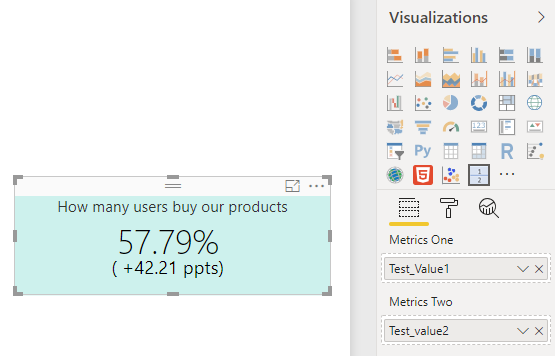
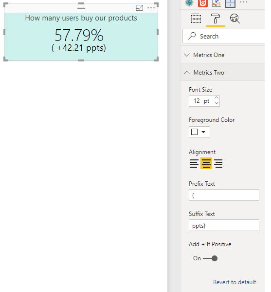

# Dual Metrics Card

Display two metrics in a card visual. Metrics one is at top. Metrics two is at bottom. Both metrics can configure styling including font size and foreground colors. Prefix and suffix texts are supported to customize the display.

## Build and Debug

1. NPM Install

```
npm install
```

2. Start debugging

```
pbiviz start
```

## Build Package

```
pbiviz package
```

### History Packages

[1.0.17](./bin/1.0.17/dualMetricsCard.pbiviz)

### Usage

You may add measures to "Metrics One" and "Metrics Two".



There are styling sections particularly for this visual: "Metrics One" and "Metrics Two". Either of one have following options

* Font Size
* Foreground Color
* Text alignment
* Prefix Text and Suffix Text if you want to display additional texts before and after the measure value (in the screenshot, it demonstrates that we want to display the percentage points increase).
* Add "+" sign if the value is positive.

